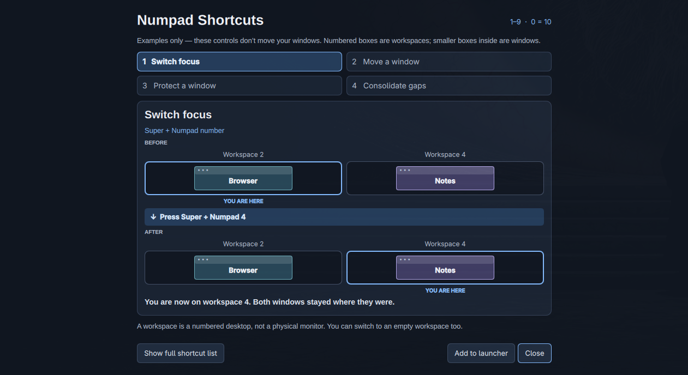

# Numpad Shortcuts



An Omarchy service and guide-panel plugin that adds the number-pad equivalents
of Omarchy’s workspace and terminal shortcuts.

- `Super` + keypad `1`–`9` switches to workspaces 1–9.
- `Super` + keypad `0` switches to workspace 10.
- `Super` + keypad `Enter` opens the terminal.

The workspace shortcuts work with Num Lock either on or off. The plugin also
sets Hyprland’s `input:numlock_by_default` option to `true` for the current
session, so newly initialized keypads start in numeric mode. The shortcuts are
restored automatically after Hyprland reloads its configuration.

## Guide

Toggle the guide with `Super + Ctrl + keypad Divide`. It teaches the shortcuts
with four topic buttons and a separate before/after example for each action.
Numbered boxes represent workspaces; the smaller labeled boxes inside represent
windows. Blue outlines mark where you are focused. The examples resize with the
guide, including when Hyprland tiles it into a narrow window.

The four topics are:

- **Switch focus** — move the focus outline to another workspace, occupied or empty;
  windows stay where they are.
- **Move a window** — send the focused window to a target workspace, occupied or empty.
- **Protect a window** — keep the focused window in place during consolidation
  for the current session.
- **Consolidate gaps** — shift unprotected workspace groups left into blank
  numeric workspaces; add `Alt` to limit this to the focused monitor.

The examples show focus moving while windows stay put, and a window moving to a
blank workspace with focus following it. Either action works with occupied or
empty targets. In the consolidation example, select **Protect Photos** to see
why a protected window leaves a gap. **All monitors** and **This monitor** show
the corresponding shortcuts. These controls only change the illustration.

Choose **Show full shortcut list** in the guide to expand the live binding
inventory: workspace switching and moving (including Num Lock-off variants),
terminal, this guide, protection, and both consolidation actions.

### Optional launcher entry

**Add to launcher** is explicit and optional: it asks for confirmation before
creating `~/.local/share/applications/cylon58-numpad-shortcuts-guide.desktop`.
The launcher summons the guide, so activating it again keeps the guide open.
It never overwrites an existing custom launcher. The plugin owns and removes
only that file when it carries the
`X-Omarchy-Numpad-Shortcuts-Guide=true` marker; remove it with:

```bash
~/.config/omarchy/plugins/cylon58.numpad-shortcuts/bin/manage-launcher-entry remove
```

## Window management

| Shortcut | Action |
| --- | --- |
| `Super + Shift + keypad 1–0` | Move the focused window to workspace 1–10. |
| `Super + Ctrl + keypad Enter` | Toggle session-only protection for the focused window. |
| `Super + Ctrl + Shift + keypad Enter` | Consolidate numeric workspaces 1–10 across monitors. |
| `Super + Ctrl + Shift + Alt + keypad Enter` | Consolidate the focused monitor without taking IDs owned by another monitor. |

Protected windows remain in place during consolidation, while unprotected
neighbors can move. Manual window moves are still allowed. A notification
confirms protection; there is no permanent title-bar icon. Protection ends with
the window, Hyprland, or a Hyprland configuration reload. Consolidation does not follow the moved windows, may
leave intentional gaps, and recalculates window layouts at the destination.

## Requirements

- Omarchy with Quickshell and Hyprland

## Install

```bash
omarchy plugin add https://github.com/cylon58/omarchy-numpad-shortcuts.git --enable
```

## Update

```bash
omarchy plugin update cylon58.numpad-shortcuts
```

## Remove

```bash
omarchy plugin remove cylon58.numpad-shortcuts
hyprctl reload
```

Run `hyprctl reload` after removal to clear the session-only dynamic bindings.

## Security boundaries

The service runs only the fixed `/usr/bin/hyprctl` executable with a minimal
environment. It has no network access, shell execution, elevated privileges,
or retained command output. It polls the active Hyprland instance and binding
table, restoring the shortcuts when a reload clears them. Binding updates are
stopped after 10 seconds if `hyprctl` does not complete. The same fixed
evaluation path loads this plugin's Lua module.

## License

MIT. See [LICENSE](LICENSE).
